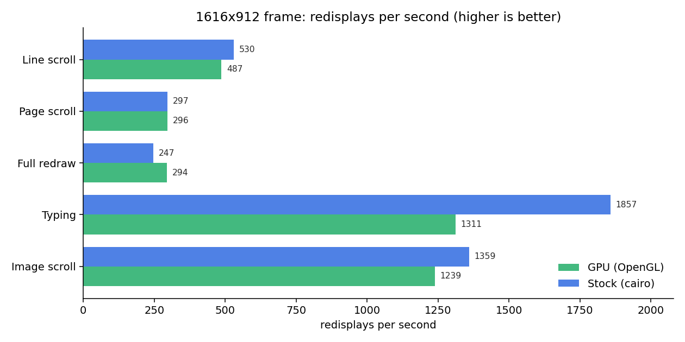
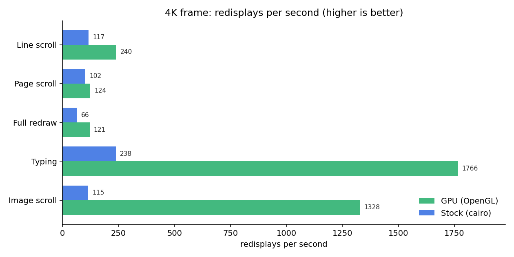
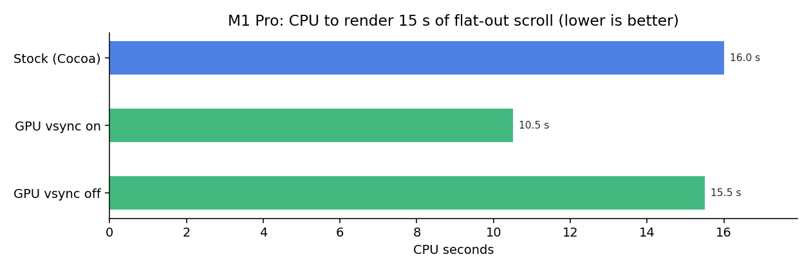

# emacs-gpu

GNU Emacs with a GPU-accelerated display backend.

The drawing logic is platform-neutral (`src/gfxterm.c`) behind a small
driver interface (`src/gfxdrv.h`), with one driver per platform:

- **GNU/Linux and other X11 systems**, **OpenGL ES / EGL**
  (`src/glterm.c`): Beta. Renders text, faces, decorations, images,
  fringes, scrolling and the cursor pixel-accurately against the stock
  GTK/cairo backend, with inline video, a GPU buffer-switch cross-fade
  and animated cursor effects.
- **macOS**, native **Apple Metal** (`src/mtlterm.m`): feature-complete.
  Text goes through a GPU glyph atlas, images and inline video are
  textures, and the whole frame is composited by the GPU instead of
  CoreGraphics. The output is pixel-accurate against the stock Cocoa
  backend.

Build it for the current platform with a single flag, `--with-gpu`
(Metal on macOS, OpenGL on Linux). Without it (and without `--with-mtl`
or `--with-gl`) Emacs builds with the stock CPU renderer.

## Why a GPU backend?

Beyond raw rendering, it enables things the stock backend cannot do:

- **Video playback**: decoded straight into a GPU texture and composited
  inside the buffer, following scrolling and clipped to the window. No
  xwidgets, no embedded browser. Opening a video file (for example with
  `RET` in Dired) plays it in a dedicated buffer with autoplay, looping,
  and a clickable play/pause and timeline; video can also be embedded
  inline at point. macOS decodes with AVFoundation straight into Metal
  textures (zero copies); GNU/Linux decodes with GStreamer.
- **GPU cursor effects** (opt-in): expanding rings, comet trails and
  friends are drawn as a compositor overlay, without ever touching the
  buffer content underneath.
- **A path to cheap visual effects**: buffer transitions, smooth
  scrolling or any future eye candy is one more shader pass over the
  composited frame, not a rewrite of the display engine.

Text is rasterized once into a GPU glyph atlas and drawn as textured
quads; scrolling moves already-rendered pixels with a texture blit.

> Status: **Beta**. The backend is fully functional on macOS (Metal) and
> GNU/Linux (OpenGL/X11), with comprehensive parity testing and production
> builds available as precompiled packages. Known limitations: Intel builds
> and universal binaries on macOS (currently arm64 only), and Wayland on
> Linux (X11 only). All Emacs display features are reproduced; the GPU path
> is opt-in via `--with-gpu` or runtime `EMACS_GPU_DISABLE=1`.
>
> **Note:** I am not answering issues for now. Feel free to open them as
> a public record (they will be read eventually), but do not expect a
> reply at this stage.

## GPU vs stock CPU rendering: when each wins

| Workload | Best backend | Why |
|---|---|---|
| Typing, plain editing | **Stock CPU** | cairo touches only the few dirty pixels with near-zero per-frame overhead; both are far faster than perceptible |
| Static text scroll / redraw | **Even** (GPU ahead on full redraws) | shared redisplay cost dominates; batching made the GPU side competitive |
| Animations: smooth scroll, buffer cross-fade | **GPU** | composites cached textures with a shader pass instead of re-rasterizing on the CPU each frame |
| Inline video playback | **GPU only** | decoded straight into a GPU texture and composited in the buffer; the CPU backend cannot do it (macOS via AVFoundation, GNU/Linux via GStreamer) |
| Animated cursor effects (rings, trail) | **GPU only** | drawn as a compositor overlay, no CPU equivalent |
| Large images / HiDPI / 4K full-window motion | **GPU** | cost stays flat as pixels grow, while cairo's scales with pixels x frames |

Short version: for everyday text the stock CPU renderer is as fast or
faster and there is no reason to switch on its account. The GPU backend
earns its place on **motion, effects and video**, things the CPU path
either does more expensively or cannot do at all.

## Contents

- [GNU/Linux (OpenGL)](#gnulinux-opengl)
- [macOS (Apple Metal)](#macos-apple-metal)
- [How it works](#how-it-works)

---

# GNU/Linux (OpenGL)

The Linux driver renders through **OpenGL ES 3 on EGL**, rasterizing
glyphs with FreeType into a GPU atlas (the cross-platform counterpart of
the Metal driver, sharing the same `src/gfxterm.c` drawing policy). It
runs on a real X server (GPU-accelerated, on-screen) and headless under
Xvfb (for the pixel-parity test harness).

## Status

Beta, fully functional. Verified pixel-accurate against stock GTK/cairo
Emacs (same binary, GPU on vs off) across comprehensive test coverage:

- Text: ASCII/Latin/CJK/symbols, bold/italic/`:height`, font-lock, face
  inheritance, compositions, **color glyphs / emoji**, BiDi.
- Decorations: underline (single/double/wave), overline, strike-through,
  box and relief (mode line, buttons).
- Display props, overlays, line numbers, `hl-line`, margins, **fringes**
  (custom bitmaps), wrap/truncation, hscroll.
- Mode/header/tab lines and tab bar.
- Images: PNG/JPEG/SVG with alpha, plus **animated GIF** (Emacs advances
  the frames; the GPU re-rasterizes each one).
- **HiDPI** (`GL_SCALE` supersampling), `scroll_run` (pixel-identical to
  a fresh repaint), the four cursor types.
- **Buffer-switch cross-fade**: changing the buffer in a window fades the
  previous content out over the new one on the GPU (on by default, same
  `gpu-buffer-transitions` / `gpu-buffer-transition-duration` knobs as
  macOS).
- **Inline video** (`gpu-video-insert`, `gpu-video-mode`): GStreamer decodes
  the file into RGBA frames the driver uploads as a texture and composites
  over the buffer, following scrolling and clipped to the window.  Built
  when GStreamer development files are present (see the build deps below).

- **Cursor effects**: the same animated cursors as macOS (spring glide,
  torpedo trail, sonicboom/ripple/pixiedust particle bursts, hollow,
  beam), composited over the frame in the present pass. The default
  effect on the OpenGL backend is `sonicboom`; pick another with
  `(setq gpu-cursor-animation 'spring)` or `M-x gpu-set-cursor`.

Raw text throughput is at or near parity with cairo on an integrated
GPU -- full-frame redraws are faster, typing is still behind (see
[Performance](#performance-linux)).

The backend rasterizes glyphs through cairo/FreeType (`ftcr`/`ftcrhb`
fonts). If Emacs falls back to a legacy **core-X font** (`xfont`) for a
script no scalable font on your system covers (e.g. CJK/Hangul with no
matching Noto font installed), those glyphs are skipped rather than
drawn; install a scalable font that covers the script (the stock cairo
backend draws them through cairo-xlib instead).

## Installing on Linux (prebuilt .deb)

Prebuilt amd64 packages (gtk3 + GPU + tree-sitter + native-comp AOT)
are attached to each [release](https://github.com/tanrax/emacs-gpu/releases).
They install as `/usr/bin/emacs` and conflict with the distro `emacs`
packages. Pick the one matching your distro (Debian and Ubuntu ship
incompatible libjpeg sonames, hence two packages):

```sh
# Debian 12
sudo apt install ./emacs-gpu_<version>_amd64.debian12.deb
# Ubuntu 24.04+ / Mint 22+
sudo apt install ./emacs-gpu_<version>_amd64.ubuntu24.04.deb
```

The GPU path enables itself on X11; start with `EMACS_GPU_DISABLE=1` to
get the stock CPU renderer from the same binary.

## Building on Linux

Build this repository (the GPU-enabled Emacs), not the stock Emacs.
Building from source works on any X11 Linux with the development
libraries below; it is not tied to a particular distro release the way
a prebuilt `.deb` is.

Install the build toolchain and the development libraries. On
Debian/Ubuntu and derivatives:

```sh
sudo apt install build-essential autoconf automake texinfo pkg-config \
  libgtk-3-dev libgnutls28-dev libxml2-dev libncurses-dev \
  libfreetype-dev libharfbuzz-dev librsvg2-dev libxpm-dev \
  libgif-dev libjpeg-dev libpng-dev libtiff-dev libwebp-dev \
  libegl-dev libgles-dev \
  libgstreamer1.0-dev libgstreamer-plugins-base1.0-dev \
  gstreamer1.0-plugins-good gstreamer1.0-libav
```

`libegl-dev libgles-dev` is what the GPU backend needs on top of a normal
Emacs build.  The GStreamer packages are optional: they add inline video
(`gpu-video-insert`, `gpu-video-mode`); without them the backend builds
fine, just without video.  On other distros install the equivalent
`-dev`/`-devel` packages (GTK 3, GnuTLS, FreeType, HarfBuzz, librsvg, the
image libraries, EGL and OpenGL ES, and GStreamer with its base/good/libav
plugins for video).

Then build:

```sh
git clone https://github.com/tanrax/emacs-gpu.git
cd emacs-gpu

./autogen.sh
./configure --with-x-toolkit=gtk3 --with-gpu
make -j$(nproc)
```

`--with-gpu` auto-detects the platform and enables the OpenGL backend on
X11 (it is the same as `--with-gl`). It requires the X11 build (do not
pass `--without-x`) and the FreeType font backend; `configure` reports
`HAVE_GFX_GL` and stops with a clear message if EGL, OpenGL ES or
FreeType are missing.

The binary is `src/emacs`. Install it under `--prefix` (default
`/usr/local`) with:

```sh
sudo make install
```

## Enabling the GPU backend

When Emacs is built `--with-gpu` and the OpenGL backend is available, it
is enabled automatically on every graphical frame at startup, the same
way Metal is on macOS. Start with the stock CPU renderer instead by
setting `EMACS_GPU_DISABLE` to a non-empty value:

```sh
EMACS_GPU_DISABLE=1 emacs
```

You can also enable it manually on a given frame (for example after
starting with it disabled):

```elisp
(gpu-enable)                           ; or (gpu-enable-for-frame FRAME)
```

| Command | What it does |
|---|---|
| `M-x gpu-status` | Show the active GPU device |
| `M-x gpu-enable` | Enable the backend on the current frame |
| `M-: (gpu-device-name)` | The renderer string (for example `AMD Radeon Graphics ...`) |
| `M-: (gpu-backend-p)` | Whether the backend is compiled in and available |

Inline video (`gpu-video-insert`, `gpu-video-mode`), the buffer-switch
cross-fade and the animated cursor effects (`M-x gpu-set-cursor`) all
work on the OpenGL backend.

## Performance (Linux)

This is what the emacs-devel thread asked for: stock Emacs (X11/cairo)
versus the OpenGL backend on the **same binary**, GPU enabled vs
disabled. Measured on a laptop with an integrated **AMD Radeon (Renoir,
radeonsi)** GPU, a 1616x912 frame, an 8000-line font-locked Emacs Lisp
buffer, vsync off on the GPU side so the numbers reflect frame cost
rather than the 60 Hz cap (median of 3 runs, redisplays per second):

| Workload | Stock (X/cairo) | GPU (OpenGL) | Ratio |
|---|---:|---:|---:|
| Line scroll (1 line/frame) | 530 fps | 487 fps | 0.92x |
| Page scroll | 297 fps | 296 fps | 1.00x |
| Full-frame redraw | 247 fps | 294 fps | **1.19x** |
| Typing (1 char + redisplay) | 1857 fps | 1311 fps | 0.71x |
| Image scroll | 1359 fps | 1239 fps | 0.91x |



The big win is structural: glyphs **and** solid fills (backgrounds,
underlines, boxes) share one submission-ordered vertex batch, clipped
on the CPU, so a whole redraw flushes as a handful of draw calls --
full-frame redraw is now **faster than cairo** on this machine. The
present itself stays deliberately simple and robust: blit the whole
frame, swap with full damage. A partial present (blit only what the
aged back buffer misses, hand the compositor damage rectangles via
`EGL_EXT_buffer_age` + `eglSwapBuffersWithDamage`) exists behind
`GL_PARTIAL_PRESENT=1` but is experimental: it buys ~10% on workloads
already above a thousand frames per second, and in testing it had to
fight asynchronous races against the driver's buffer rotation, the
window manager's resizes and the compositor's damage tracking --
stability won. The output stays pixel-identical to stock Emacs across
the whole parity suite.

Honest reading: typing and line scrolling on a laptop-sized frame are
still **slower than cairo**, which is extremely good at small dirty
rectangles -- our floor is one EGL buffer swap per redisplay, cairo's is
a tiny damage rectangle with no swapchain. In absolute terms every
workload is far above what is perceptible (the worst case, typing, is
~0.8 ms per keystroke), so this is a throughput ratio, not a
responsiveness problem.

A GPU backend does not beat a mature CPU rasterizer at *static* text:
cairo only touches the few dirty pixels on the CPU with near-zero
per-frame overhead, and both are already thousands of frames per second.
Where the GPU pulls ahead is **motion at high pixel counts**: as the
frame grows, cairo's cost scales with pixels x frames while the GPU
composites pre-uploaded textures at a flat cost.

The same workloads at a **4K frame** (3760x2210, GPU rendering to its FBO
on the real AMD GPU versus cairo on the CPU; render throughput, the GPU
side excludes on-screen present) flip the result:

| Workload | cairo (CPU) | GPU | Speedup |
|---|---:|---:|---:|
| Line scroll | 117 fps | 240 fps | **2.05x** |
| Page scroll | 102 fps | 124 fps | 1.22x |
| Full-frame redraw | 66 fps | 121 fps | **1.84x** |
| Typing | 238 fps | 1766 fps | **7.4x** |
| Image scroll | 115 fps | 1328 fps | **11.5x** |



cairo slows down roughly linearly with the pixel count; the GPU barely
moves. Image scrolling is the extreme case (cairo re-blits the image from
CPU memory every frame, the GPU re-composites a cached texture). This,
plus the GPU-only features (video, cross-fades, cursor effects), is the
real value; raw text throughput on a small frame is not.

Reproduce it with the harness in this repository (on the test machine):
`bench/run-bench.sh` for the on-screen 1616x912 numbers and
`bench/run-bench-hires.sh` for the headless 4K render-throughput table.


---

# macOS (Apple Metal)

The Metal backend is feature-complete: all of the text, faces,
decorations, images, GIF, line numbers, fringes, mode/header/tab lines,
Retina/HiDPI, dynamic `text-scale`, splits and the four cursor types
render pixel-accurately against the stock Cocoa backend, plus inline
video, cursor effects and buffer transitions.

## Performance (macOS)

Measured on an Apple M1 Pro (Emacs 32 development build, 120x45 frame,
font-locked `xdisp.c`, same binary with and without the GPU backend;
`/usr/bin/time -l` over scripted workloads):

| Workload | Stock (Cocoa) | GPU, vsync on (default) | GPU, vsync off |
|---|---:|---:|---:|
| Sustained scroll, redisplays/s | 481 | 324 | 475 |
| CPU for 15 s of that scroll | 16.0 s | **10.5 s** | 15.5 s |
| Typing throughput (chars/s, machine-paced) | 108 | 52 | 106 |
| Idle (8 s) CPU | 1.21 s | 1.19 s | same |
| Peak RSS | ~140 MB | ~144 MB | same |



Honest reading:

- **Machine-paced throughput and CPU cost match the stock backend**
  (vsync off). There is no GPU tax.
- With vsync on (the default), presents wait for the display refresh:
  the screen shows the same 60 fps either way, but Emacs burns ~35%
  less CPU under flat-out scrolling because it stops rendering frames
  nobody can see. Human-paced input is unaffected (the cap is ~52
  machine-paced updates/s; keyboard auto-repeat tops out well below
  that). `(gpu-vsync nil)` switches to uncapped, stock-like behavior.
- Idle cost is identical and the GPU resources add ~4 MB of RSS.

## Demos

Inline video playing inside a buffer, decoded by AVFoundation straight
into Metal textures (`gpu-video-insert`):


An animated GIF playing next to font-locked code scrolling, all
composited by the GPU:


GPU cursor effects (`gpu-animations`), here the *sonicboom* mode:


Buffer switches cross-fade on the GPU (on by default, configurable):


## Installing

With Homebrew (Apple Silicon, macOS 13 Ventura or newer):

```sh
brew install --cask tanrax/tap/emacs-gpu
```

Or grab the signed, self-contained `Emacs.app` from the
[releases](https://github.com/tanrax/emacs-gpu/releases). The release
build ships with native compilation (AOT) and tree-sitter enabled.

## Building on macOS

Requires Xcode (or the Command Line Tools) and the build dependencies:

```sh
brew install autoconf automake gnutls texinfo pkg-config \
  tree-sitter libgccjit
```

`tree-sitter` and `libgccjit` are only needed for the `--with-tree-sitter`
and `--with-native-compilation` options below, which match the release
build. Drop those options (and the extra flags) for a faster, minimal build.

```sh
./autogen.sh

SDK=$(xcrun --sdk macosx --show-sdk-path)
CC="xcrun clang" OBJC="xcrun clang" \
CFLAGS="-isysroot $SDK -I/opt/homebrew/include" \
CPPFLAGS="-isysroot $SDK -I/opt/homebrew/include" \
OBJCFLAGS="-isysroot $SDK -I/opt/homebrew/include" \
LDFLAGS="-L/opt/homebrew/lib -L/opt/homebrew/lib/gcc/current" \
PKG_CONFIG_PATH="/opt/homebrew/lib/pkgconfig" \
./configure --with-ns --with-gpu --with-tree-sitter \
  --with-native-compilation=aot

make -j$(sysctl -n hw.ncpu)
```

`--with-gpu` enables Metal on macOS (it is the same as `--with-mtl`).
Native compilation (AOT) makes the first build noticeably longer, as it
compiles the whole Lisp tree. The binary is `src/emacs` (or build the
app bundle with `make install`, which writes it to `nextstep/Emacs.app`).

## Enabling the GPU backend

When Emacs is built with Metal and Metal is available, the GPU backend
is loaded and enabled automatically on the initial frame at startup. This
applies to both the release app bundle and source builds. To start with
the stock Cocoa backend instead, set the environment variable
`EMACS_GPU_DISABLE` to any non-empty value:

```sh
EMACS_GPU_DISABLE=1 emacs
```

You can also enable it manually on a given frame (for example after
starting with it disabled):

```elisp
(require 'gpu)
(gpu-enable)
```

## Commands and options

| Command | What it does |
|---|---|
| `M-x gpu-status` | Show backend state: GPU device, animations, cursor mode |
| `M-: (gpu-draw-stats)` | Renderer counters; `glyphs-drawn` growing proves the GPU is painting |
| `M-x gpu-toggle-animations` | Toggle the GPU compositor overlay used by cursor effects |
| `M-x gpu-set-cursor` | Pick the cursor effect: `block` (static, default, no effect), `sonicboom` (ring), `torpedo` (comet trail), `spring`, `ripple`, `pixiedust`, `hollow`, `beam` |
| `M-: (gpu-vsync nil)` | Uncap presents from the display refresh (lower latency, more power) |
| `M-: (gpu-video-insert "clip.mp4" 480 270 t)` | Play a video inline at point; follows scrolling |
| `M-x gpu-video-stop` | Stop the inline video |

### Playing video files

Visiting a video file (`mp4`, `mov`, `m4v`, `3gp`) opens it in
`gpu-video-mode`: a dedicated buffer that autoplays and loops the video,
fit to the window, with a play/pause button and a clickable, draggable
timeline. From Dired just press `RET` on the file.

| Key | Action |
|---|---|
| `SPC` | Play / pause |
| `←` / `→` | Seek backward / forward by `gpu-video-seek-step` seconds (default 5) |
| `<` | Seek to the start |
| `mouse-1` on the timeline | Jump to that point (drag to scrub) |

Customize the recognized extensions with `gpu-video-file-extensions`
(then run `M-x gpu-video-register-auto-mode`). Animated GIFs keep using
the built-in `image-mode`, which already animates them on the GPU.

Cursor effects are opt-in. Pick one interactively with
`M-x gpu-set-cursor`, or set it in your init file. For example, to
enable the *sonicboom* effect (an expanding ring on cursor jumps):

```elisp
;; `gpu' is loaded at startup, so defer until it is available.
(with-eval-after-load 'gpu
  (setopt gpu-cursor-animation 'sonicboom))
```

Other modes: `block` (default, no effect), `torpedo` (comet trail),
`spring`, `ripple`, `pixiedust`, `hollow`, `beam`.

Cursor effects trigger on cursor jumps (`M-<`, `M->`, isearch hits),
not on single-character movement. They are also suppressed while
typing or editing text, so they fire only when you move the cursor,
not on every inserted or deleted character. To get the effects while
typing too:

```elisp
(setq gpu-cursor-effects-while-typing t)
```

Buffer switches cross-fade by default; tune or disable with:

```elisp
(setq gpu-buffer-transition-duration 0.15) ; seconds
(setq gpu-buffer-transitions nil)          ; turn it off
```


---

# Visual QA

A companion repository contains the manual visual test harness: one
subdirectory per rendering category (text, decorations, cursor, scroll,
images, fringe, bars, windows, overlays, transitions, video, edge cases),
each with a `README.org` checklist and a `test.el` that loads an identical
scenario in both the GPU backend and the vanilla baseline for side-by-side
comparison.

**[emacs-gpu-qa](https://git.andros.dev/andros/emacs-gpu-qa)**

---

# How it works

```
redisplay engine (xdisp.c, untouched)
        ↓
src/gfxterm.c   platform-neutral drawing policy
        ↓
src/gfxdrv.h    driver interface (~25 ops)
        ↓
   ┌────────────────────────────┴────────────────────────────┐
src/mtlterm.m (macOS)                       src/glterm.c (Linux/X11)
Metal driver: glyph atlas                   OpenGL ES / EGL driver:
(CoreText → R8 texture), render             FreeType glyph atlas, FBO
cycle on a persistent texture,              render target, on-screen
AVFoundation video through                  present via window surface
CVMetalTextureCache                         blit + eglSwapBuffers
```

# License

GNU General Public License v3 or later, same as GNU Emacs.
