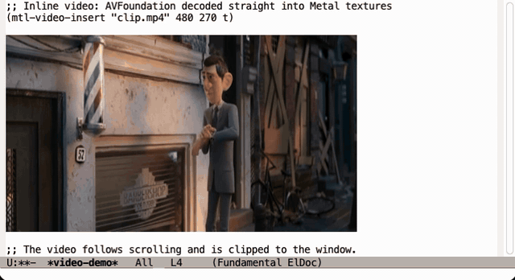
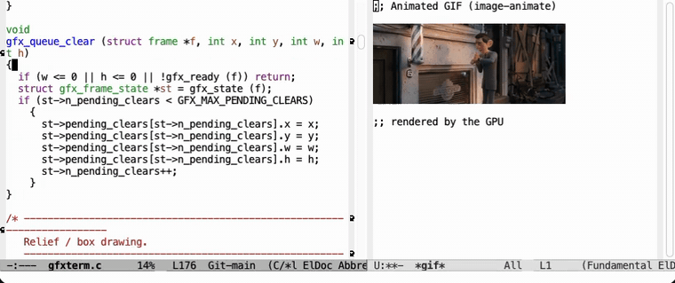
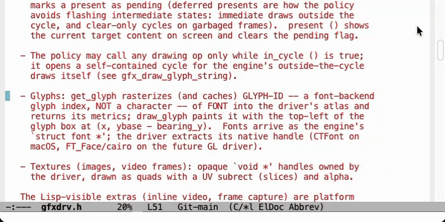

# emacs-gpu

GNU Emacs with a GPU-accelerated display backend.

On **macOS** it renders with **native Apple Metal**: text goes through a
GPU glyph atlas, images and inline video are textures, and the whole
frame is composited by the GPU instead of CoreGraphics. The output is
pixel-accurate against the stock Cocoa backend.

**OpenGL support for GNU/Linux and Windows is planned but not implemented
yet.** The drawing logic is already platform-neutral (`src/gfxterm.c`)
behind a small driver interface (`src/gfxdrv.h`); an OpenGL driver only
needs to implement that interface (`src/glterm.c` is the documented
skeleton). Contributions welcome.

> Status: experimental, under active development.
>
> **Note:** I am not answering issues for now. Feel free to open them as
> a public record (they will be read eventually), but do not expect a
> reply at this stage.

## Demos

Inline video playing inside a buffer, decoded by AVFoundation straight
into Metal textures (`mtl-video-insert`):



An animated GIF playing next to font-locked code scrolling, all
composited by the GPU:



GPU cursor effects (`mtl-animations`), here the *sonicboom* mode:



## Building on macOS

Requires Xcode (or the Command Line Tools) and the usual Emacs build
dependencies (`brew install autoconf automake gnutls texinfo pkg-config`).

```sh
./autogen.sh

SDK=$(xcrun --sdk macosx --show-sdk-path)
CC="xcrun clang" OBJC="xcrun clang" \
CFLAGS="-isysroot $SDK" CPPFLAGS="-isysroot $SDK" OBJCFLAGS="-isysroot $SDK" \
./configure --with-ns --with-mtl

make -j$(sysctl -n hw.ncpu)
```

The binary is `src/emacs` (or install the app bundle from `nextstep/`).

## Enabling the GPU backend

Emacs starts with the regular Cocoa backend; switch a frame to Metal
with:

```elisp
(add-to-list 'load-path "/path/to/emacs-gpu/lisp")
(require 'mtl)
(mtl-enable)
```

Extras once enabled:

```elisp
(mtl-video-insert "video.mp4" 480 270 t)  ; inline video, follows scrolling
(mtl-animations t)                        ; GPU cursor effects (experimental)
(mtl-draw-stats)                          ; renderer counters
```

## How it works

```
redisplay engine (xdisp.c, untouched)
        ↓
src/gfxterm.c   platform-neutral drawing policy
        ↓
src/gfxdrv.h    driver interface (~25 ops)
        ↓
src/mtlterm.m   Metal driver: glyph atlas (CoreText → R8 texture),
                render cycle on a persistent texture, AVFoundation
                video through CVMetalTextureCache
```

## License

GNU General Public License v3 or later, same as GNU Emacs.
