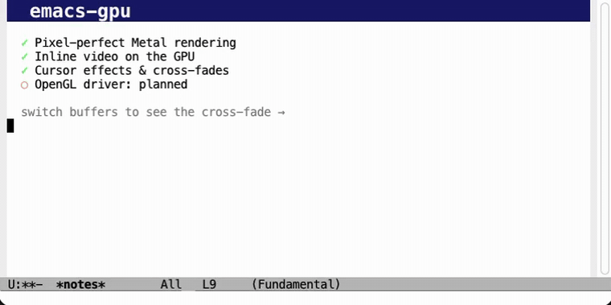

# emacs-gpu

GNU Emacs with a GPU-accelerated display backend.

On **macOS** it renders with **native Apple Metal**: text goes through a
GPU glyph atlas, images and inline video are textures, and the whole
frame is composited by the GPU instead of CoreGraphics. The output is
pixel-accurate against the stock Cocoa backend.

**OpenGL support for GNU/Linux and Windows is planned but not implemented
yet.** The drawing logic is already platform-neutral (`src/gfxterm.c`)
behind a small driver interface (`src/gfxdrv.h`); an OpenGL driver only
needs to implement that interface (`src/glterm.c` is the documented
skeleton). Contributions welcome.

## Why a GPU backend?

Beyond raw rendering, it enables things the stock backend cannot do:

- **Inline video playback**: AVFoundation decodes straight into Metal
  textures (zero copies) and the frames are composited inside the
  buffer, following scrolling and clipped to the window. No xwidgets,
  no embedded browser.
- **GPU cursor effects** (opt-in): expanding rings, comet trails and
  friends are drawn as a compositor overlay, without ever touching the
  buffer content underneath.
- **A path to cheap visual effects**: buffer transitions, smooth
  scrolling or any future eye candy is one more shader pass over the
  composited frame, not a rewrite of the display engine.

Text is rasterized once into a GPU glyph atlas and drawn as textured
quads; scrolling moves already-rendered pixels with a texture blit.

## Performance

Measured on an Apple M1 Pro (Emacs 32 development build, 120x45 frame,
font-locked `xdisp.c`, same binary with and without the GPU backend;
`/usr/bin/time -l` over scripted workloads):

| Workload | Stock (Cocoa) | GPU, vsync on (default) | GPU, vsync off |
|---|---|---|---|
| Sustained scroll, redisplays/s | 481 | 324 | 475 |
| CPU for 15 s of that scroll | 16.0 s | **10.5 s** | 15.5 s |
| Typing throughput (chars/s, machine-paced) | 108 | 52 | 106 |
| Idle (8 s) CPU | 1.21 s | 1.19 s | same |
| Peak RSS | ~140 MB | ~144 MB | same |

Honest reading:

- **Machine-paced throughput and CPU cost match the stock backend**
  (vsync off). There is no GPU tax.
- With vsync on (the default), presents wait for the display refresh:
  the screen shows the same 60 fps either way, but Emacs burns ~35%
  less CPU under flat-out scrolling because it stops rendering frames
  nobody can see. Human-paced input is unaffected (the cap is ~52
  machine-paced updates/s; keyboard auto-repeat tops out well below
  that). `(mtl-vsync nil)` switches to uncapped, stock-like behavior.
- Idle cost is identical and the GPU resources add ~4 MB of RSS.

> Status: experimental, under active development.
>
> **Note:** I am not answering issues for now. Feel free to open them as
> a public record (they will be read eventually), but do not expect a
> reply at this stage.

## Demos

Inline video playing inside a buffer, decoded by AVFoundation straight
into Metal textures (`mtl-video-insert`):


An animated GIF playing next to font-locked code scrolling, all
composited by the GPU:


GPU cursor effects (`mtl-animations`), here the *sonicboom* mode:


Buffer switches cross-fade on the GPU (on by default, configurable):



## Building on macOS

Requires Xcode (or the Command Line Tools) and the usual Emacs build
dependencies (`brew install autoconf automake gnutls texinfo pkg-config`).

```sh
./autogen.sh

SDK=$(xcrun --sdk macosx --show-sdk-path)
CC="xcrun clang" OBJC="xcrun clang" \
CFLAGS="-isysroot $SDK" CPPFLAGS="-isysroot $SDK" OBJCFLAGS="-isysroot $SDK" \
./configure --with-ns --with-mtl

make -j$(sysctl -n hw.ncpu)
```

The binary is `src/emacs` (or install the app bundle from `nextstep/`).

## Enabling the GPU backend

The release app bundle enables it automatically (set the environment
variable `EMACS_GPU_DISABLE=1` to start with the stock Cocoa backend
instead).  In a source build, switch a frame to Metal with:

```elisp
(add-to-list 'load-path "/path/to/emacs-gpu/lisp")
(require 'mtl)
(mtl-enable)
```

## Commands and options

| Command | What it does |
|---|---|
| `M-x mtl-status` | Show backend state: GPU device, animations, cursor mode |
| `M-: (mtl-draw-stats)` | Renderer counters; `glyphs-drawn` growing proves the GPU is painting |
| `M-x mtl-toggle-animations` | Toggle GPU cursor effects (on by default) |
| `M-x mtl-set-cursor` | Pick the cursor effect: `sonicboom` (default), `torpedo` (comet trail), `spring`, `ripple`, `pixiedust`, `hollow`, `beam`, `block` |
| `M-: (mtl-vsync nil)` | Uncap presents from the display refresh (lower latency, more power) |
| `M-: (mtl-video-insert "clip.mp4" 480 270 t)` | Play a video inline at point; follows scrolling |
| `M-x mtl-video-stop` | Stop the inline video |

Cursor effects trigger on cursor jumps (`M-<`, `M->`, isearch hits),
not on single-character movement.

Buffer switches cross-fade by default; tune or disable with:

```elisp
(setq mtl-buffer-transition-duration 0.15) ; seconds
(setq mtl-buffer-transitions nil)          ; turn it off
```

## How it works

```
redisplay engine (xdisp.c, untouched)
        ↓
src/gfxterm.c   platform-neutral drawing policy
        ↓
src/gfxdrv.h    driver interface (~25 ops)
        ↓
src/mtlterm.m   Metal driver: glyph atlas (CoreText → R8 texture),
                render cycle on a persistent texture, AVFoundation
                video through CVMetalTextureCache
```

## License

GNU General Public License v3 or later, same as GNU Emacs.
